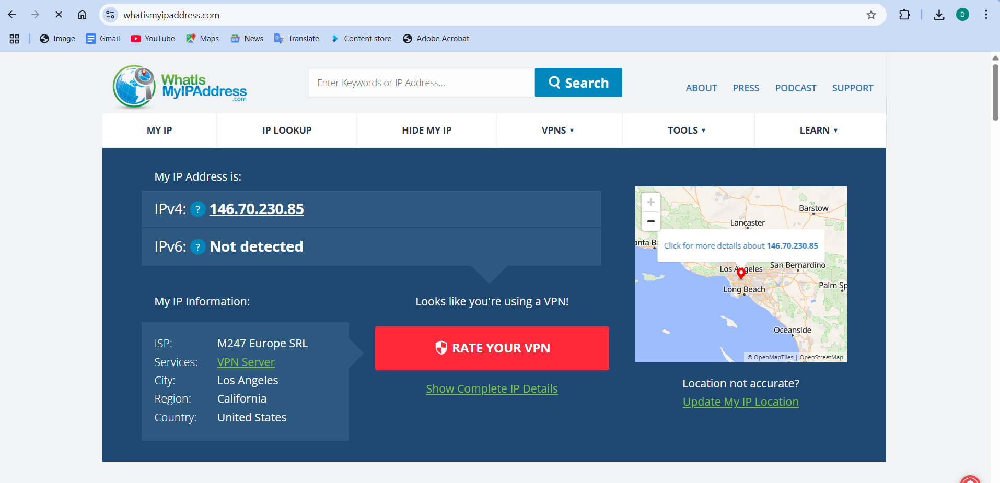
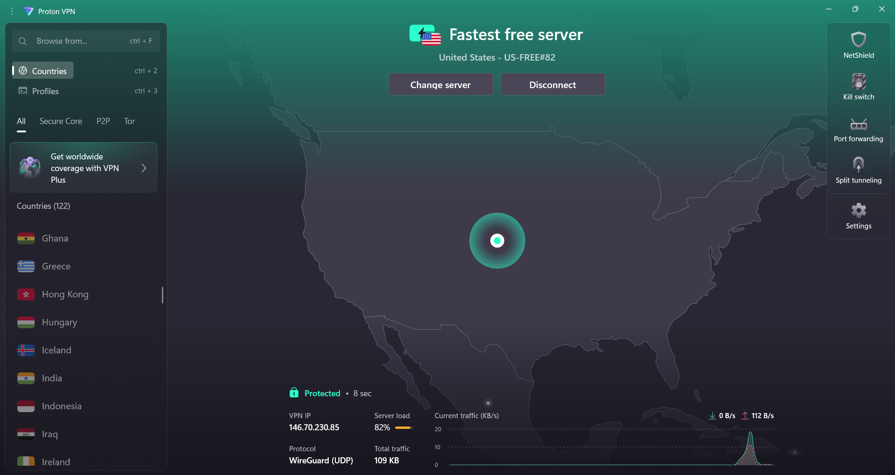
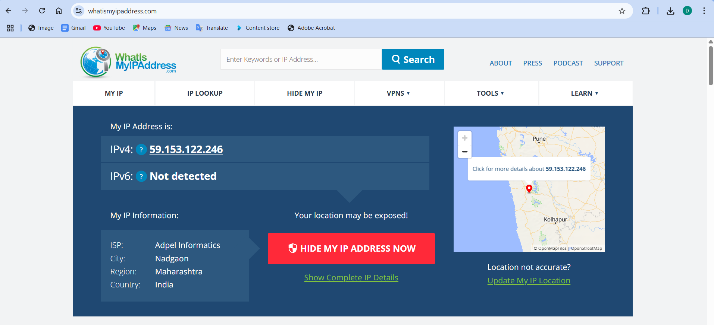
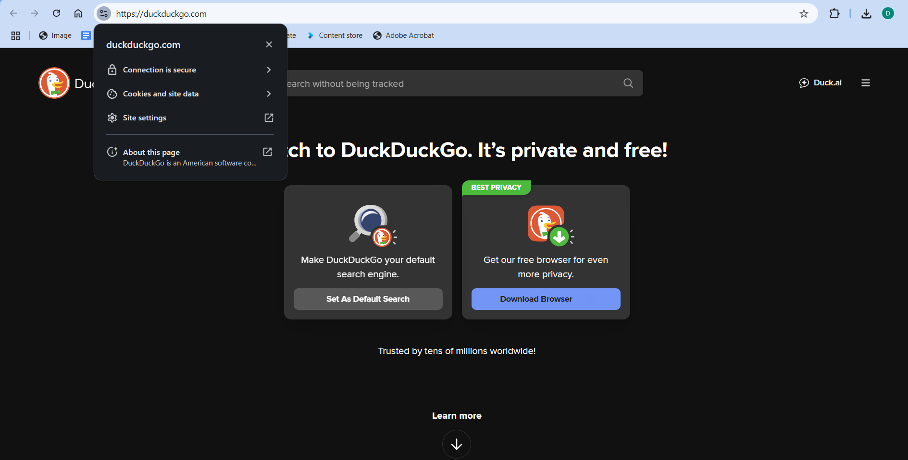
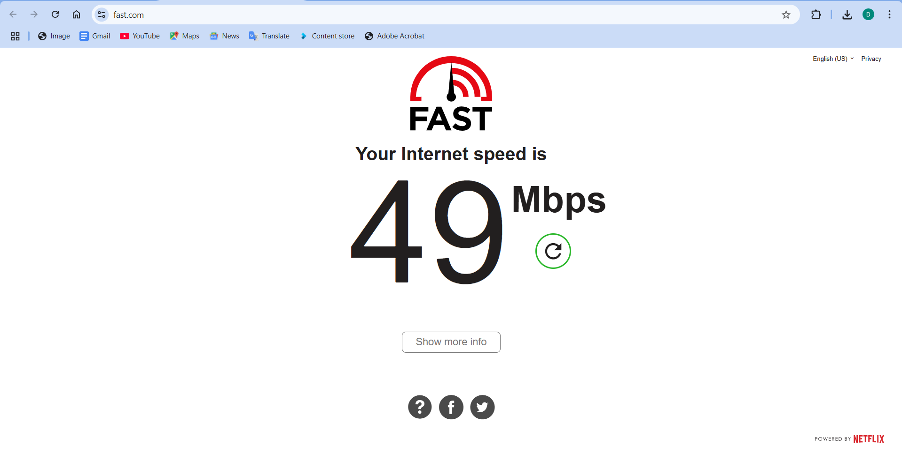
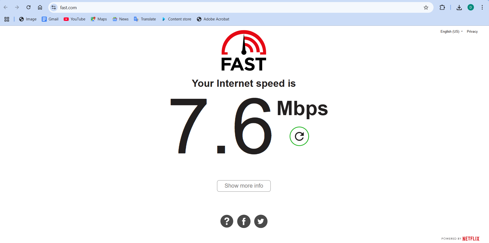

## Working with VPNs

## 🎯 Objective
Gain practical experience with VPN technology and understand how it enhances online privacy, encryption, and security.

## VPN Used
- **Provider**: ProtonVPN (Free Tier)  
- **Protocol**: WireGuard (UDP)  
- **Server**: United States - US-FREE#82  
- **VPN IP**: 146.70.230.85

## Steps Performed

1. Created a free ProtonVPN account via (https://protonvpn.com)
2. Installed the ProtonVPN client on Windows.
3. Connected to the fastest free server (US-FREE#82).
4. Verified IP change using (https://whatismyipaddress.com)
5. Accessed a secure HTTPS website (https://duckduckgo.com).
6. Performed internet speed tests with and without VPN using (https://fast.com)
7. Captured and saved screenshots of all activities.

##  Screenshots

📌 **Original IP Address (Before VPN):**  

📌 **VPN Connected (ProtonVPN Dashboard):**  

📌 **New IP Address (VPN Active):**  

📌 **Secure Website Access (HTTPS):**  

📌 **Internet Speed Test Without VPN (49 Mbps):**  

📌 **Internet Speed Test With VPN (7.6 Mbps):**  

## Summary

### What is a VPN?
A **Virtual Private Network (VPN)** creates a secure and encrypted tunnel between a user's device and the internet. It hides your IP, prevents ISP tracking, and helps ensure secure communication over public networks.

### Benefits of Using VPN
- Encrypts all network traffic
- Hides your real IP address and location
- Ensures safer browsing on public Wi-Fi
- Bypasses regional and censorship restrictions

###  Limitations of VPN
- May reduce internet speed due to encryption overhead
- Free VPNs offer limited bandwidth, servers, or features
- Cannot ensure complete anonymity alone
- Some websites and services block VPN IPs

###  Protocol Used
- **WireGuard (UDP)**  
- Known for faster performance, lower latency, and modern encryption (ChaCha20)

### Speed Test Results

| Condition         | Speed      |
|------------------ |------------|
| Without VPN       | 49 Mbps    |
| With VPN (Active) | 7.6 Mbps   |

> Speed reduction is expected as traffic is encrypted and routed through a VPN server.

##  Key Learnings
- Real-time experience of setting up and using a VPN
- Understood tunneling, encryption, and server locations
- Observed how VPN impacts browsing speed and improves privacy
